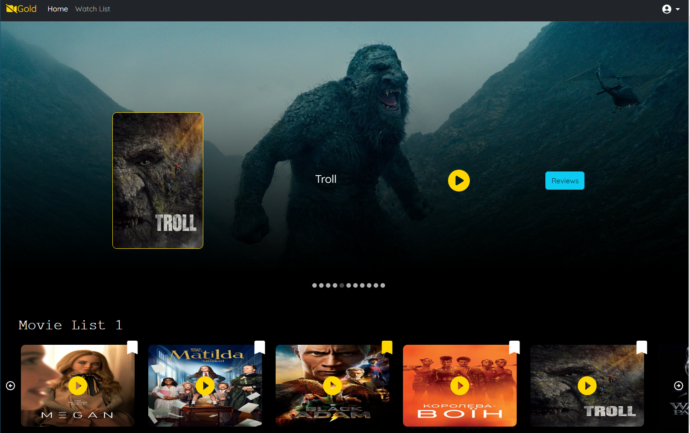

# FullStack Movie Database (MovieDB) - React, MongoDB, and Java Project

The FullStack Movie Database (MovieDB) is a web application that allows users to explore, search, and manage information about movies. Users can browse through a collection of movies, view details, and contribute by adding new movies or reviews. The app provides a platform for movie enthusiasts to connect and share their opinions.

# Features

    Movie Listings: Display a list of movies with their titles, release years, and average ratings.

    Movie Details: Show detailed information about each movie, including its user reviews.

    User Reviews: Allow registered users to write reviews and rate movies.

    User Authentication: Implement user registration and login functionality to enable personalized experiences.

# Technologies Used
# Frontend

    React: Use React.js for building the frontend, creating interactive user interfaces, and managing state.

    Styling: Apply CSS or CSS frameworks like Bootstrap for styling the website.

# Backend

    Java: Use Java for creating the backend server and handling business logic.

    Spring Boot: Implement the backend using the Spring Boot framework for efficient development..

# Database

    MongoDB: Use MongoDB as the database to store movie information, user accounts, and reviews.

# Installation and Usage

To run the FullStack MovieDB web application locally, follow these steps:

    Clone this repository to your local machine.
    Set up your MongoDB database and configure the connection in the Java Spring Boot application.
    Navigate to the frontend directory and install frontend dependencies using npm install.
    Navigate to the frontend directory and start the frontend using npm start.
    Navigate to the Java Spring Boot application directory and start the backend server.
    Access the app in your browser at http://localhost:3000.